# Flowchart Visual - Arcs 1 à 5

```mermaid
flowchart TD
    START([Début après Prologue])
    
    %% ==================== ARC I ====================
    START --> A1_DEBUT[Arc I - Printemps<br/>Vie hors écran]
    
    A1_DEBUT --> A1_SCENES[Scènes proximité:<br/>sakura, bentō, train, konbini]
    A1_SCENES --> A1_CHOIX{CHOIX: Rumeur<br/>Vous sortez ensemble?}
    
    A1_CHOIX -->|J'aimerais bien| A1_R1[+sincérité<br/>±autonomie_ilona]
    A1_CHOIX -->|Faire blague| A1_R2[+complicité<br/>ou -communication]
    A1_CHOIX -->|Nier trop vite| A1_R3[-confiance<br/>-lien_jessy_ilona]
    A1_CHOIX -->|Laisser Ilona répondre| A1_R4[+autonomie_ilona<br/>ou -communication]
    
    A1_R1 --> A1_CONF[Première confidence Ilona:<br/>En ligne c'est plus facile]
    A1_R2 --> A1_CONF
    A1_R3 --> A1_CONF
    A1_R4 --> A1_CONF
    
    A1_CONF --> A1_FIN[Entrée groupe:<br/>Allan, Alexandre, Sofiane]
    
    %% ==================== ARC II ====================
    A1_FIN --> A2_DEBUT[Arc II - Été<br/>La plage]
    
    A2_DEBUT --> A2_THEO[Entrée de Théo<br/>Observateur, rassurant]
    A2_THEO --> A2_TENSION[Théo aide Ilona<br/>Jessy ressent incertitude]
    A2_TENSION --> A2_CHOIX{CHOIX CRITIQUE:<br/>Ilona part avec Théo}
    
    A2_CHOIX -->|Amuse-toi, on se raconte| A2_R1["+confiance ++<br/>+autonomie_ilona<br/>Souvenir: libre sans abandon"]
    A2_CHOIX -->|10min pour me calmer| A2_R2["+jalousie<br/>+communication SI retour<br/>-communication SINON"]
    A2_CHOIX -->|Blague jalouse| A2_R3["+jalousie<br/>±lien<br/>Ilona gère humeur Jessy"]
    A2_CHOIX -->|Les suivre/surveiller| A2_R4["++jalousie<br/>--confiance<br/>--autonomie_ilona<br/>IMPACT MAJEUR NÉGATIF"]
    A2_CHOIX -->|S'éloigner sans rien dire| A2_R5["--communication<br/>++jalousie<br/>Blessure par le vide"]
    
    A2_R1 --> A2_CONFRONT[Ilona confronte Jessy<br/>selon sa réaction]
    A2_R2 --> A2_CONFRONT
    A2_R3 --> A2_CONFRONT
    A2_R4 --> A2_CONFRONT
    A2_R5 --> A2_CONFRONT
    
    A2_CONFRONT --> A2_PHRASE[Phrase Théo:<br/>Certains écoutent par amour<br/>d'autres par peur]
    
    %% ==================== ARC III ====================
    A2_PHRASE --> A3_DEBUT[Arc III - Rentrée<br/>Les regards]
    
    A3_DEBUT --> A3_FESTIVAL[Festival culturel<br/>Ilona et Théo au stand<br/>Rumeurs triangle]
    A3_FESTIVAL --> A3_FATIGUE[Ilona fatiguée d'être<br/>l'enjeu d'un concours]
    A3_FATIGUE --> A3_CHOIX{CHOIX: Comment<br/>être présent au festival?}
    
    A3_CHOIX -->|Aider sans réclamer centre| A3_R1["+confiance<br/>+autonomie_ilona<br/>+lien_jessy_ilona"]
    A3_CHOIX -->|Éviter puis expliquer| A3_R2["neutre SI expliqué<br/>-communication SINON"]
    A3_CHOIX -->|Saboter avec blague| A3_R3["-autonomie_ilona<br/>+jalousie<br/>-confiance"]
    A3_CHOIX -->|Demander ce qu'elle ressent| A3_R4["+communication SI écoute<br/>pression SINON"]
    
    A3_R1 --> A3_LAPLAGE[Ilona cherche espace<br/>sans attente]
    A3_R2 --> A3_LAPLAGE
    A3_R3 --> A3_LAPLAGE
    A3_R4 --> A3_LAPLAGE
    
    A3_LAPLAGE --> A3_CONF[+confidences_laplage<br/>Scène symbolique Laplage]
    
    %% ==================== ARC IV ====================
    A3_CONF --> A4_DEBUT[Arc IV - Noël<br/>Le cadeau]
    
    A4_DEBUT --> A4_CONTEXT[Illuminations, marché<br/>Théo offre aussi cadeau personnel]
    A4_CONTEXT --> A4_CHOIX{CHOIX: Quel cadeau<br/>pour Ilona?}
    
    A4_CHOIX -->|Miniature maison Minecraft| A4_R1["+lien_jessy_ilona<br/>SI bien présenté<br/>Risque si fige passé"]
    A4_CHOIX -->|Coûteux et impersonnel| A4_R2["-communication<br/>neutre lien<br/>Ilona sent pression"]
    A4_CHOIX -->|Blague interne| A4_R3["+lien_jessy_ilona<br/>Insuffisant si -communication"]
    A4_CHOIX -->|Aucun cadeau, discussion| A4_R4["++communication<br/>+confiance<br/>SI pas interrogatoire"]
    
    A4_R1 --> A4_LIMITE[Ilona pose limite:<br/>Connaître mes goûts ≠<br/>savoir ce que je veux]
    A4_R2 --> A4_LIMITE
    A4_R3 --> A4_LIMITE
    A4_R4 --> A4_LIMITE
    
    A4_LIMITE --> A4_REACT{Réaction de Jessy<br/>à la limite?}
    A4_REACT -->|Accepter sans se défendre| A4_OK["+autonomie_ilona<br/>+communication"]
    A4_REACT -->|Se justifier immédiatement| A4_BAD["-communication<br/>+jalousie"]
    
    %% ==================== ARC V ====================
    A4_OK --> A5_DEBUT[Arc V - Examens<br/>Saint-Valentin, White Day]
    A4_BAD --> A5_DEBUT
    
    A5_DEBUT --> A5_CONTEXT[Fatigue, examens, avenir<br/>Disponibilité émotionnelle réduite<br/>Théo propose de gérer]
    A5_CONTEXT --> A5_TENSION[Ilona annule sortie<br/>car épuisée<br/>Conversations reportées]
    A5_TENSION --> A5_CHOIX{CHOIX CRITIQUE:<br/>Peur de perdre ou<br/>manque de confiance?}
    
    A5_CHOIX -->|J'ai peur mais je veux<br/>apprendre à te faire confiance| A5_R1["++communication<br/>+confiance<br/>-jalousie partiel<br/>MEILLEURE RÉPONSE"]
    A5_CHOIX -->|Tu devrais savoir<br/>ce que je ressens| A5_R2["--communication<br/>-autonomie_ilona<br/>+jalousie<br/>Réparation possible"]
    A5_CHOIX -->|Théo est le problème| A5_R3["++jalousie<br/>-communication<br/>+influence_theo<br/>Évite vraie conversation"]
    A5_CHOIX -->|On en parlera plus tard| A5_R4["-communication SI jamais repris<br/>+communication SI repris avec soin"]
    
    A5_R1 --> A5_LAPLAGE[Ilona à Laplage:<br/>Personne ne demande<br/>si je suis fatiguée]
    A5_R2 --> A5_LAPLAGE
    A5_R3 --> A5_LAPLAGE
    A5_R4 --> A5_LAPLAGE
    
    A5_LAPLAGE --> A5_CONF[+confidences_laplage<br/>Proche/propriétaire confusion]
    
    %% ==================== ÉVALUATION ARCS 1-5 ====================
    A5_CONF --> EVAL{État relationnel<br/>après Arc V}
    
    EVAL -->|confiance + communication<br/>autonomie_ilona OK<br/>jalousie gérée| ROUTE_POSITIVE[Trajectoire vers<br/>Route Ilona]
    
    EVAL -->|communication faible<br/>autonomie_ilona menacée<br/>jalousie élevée| ROUTE_RISQUE[Trajectoire vers<br/>Route Séparation]
    
    EVAL -->|influence_theo élevée<br/>autonomie_ilona très faible<br/>confidences_laplage élevées| ROUTE_NOIRE[Trajectoire vers<br/>Route Théo]
    
    ROUTE_POSITIVE --> A6[Arc VI - Remise diplômes]
    ROUTE_RISQUE --> A6
    ROUTE_NOIRE --> A6
    
    A6 --> A7[Arc VII - Randonnée]
    A7 --> FINS[Fins multiples selon<br/>accumulation choix]
    
    %% ==================== LÉGENDE VARIABLES ====================
    subgraph VARIABLES["Variables clés trackées Arcs 1-5"]
        direction TB
        V1[confiance: croire sans contrôler]
        V2[communication: parler avant explosion]
        V3[autonomie_ilona: respect limites/rythme]
        V4[jalousie: peur → surveillance?]
        V5[lien_jessy_ilona: complicité]
        V6[influence_theo: aide → dépendance]
        V7[confidences_laplage: Ilona parle ailleurs]
    end
    
    %% ==================== SOUVENIRS ====================
    subgraph SOUVENIRS["Souvenirs relationnels déclenchés"]
        direction TB
        S1[ilona_libre_sans_abandon]
        S2[jessy_nomme_sa_peur]
        S3[interruptions_ilona compteur]
        S4[interruptions_reconnues]
        S5[interruptions_reparees]
        S6[jessy_repare]
        S7[theo_utilise_une_verite]
        S8[ilona_pose_une_limite]
    end
    
    %% ==================== STYLES ====================
    classDef positif fill:#d4edda,stroke:#28a745,stroke-width:2px,color:#000
    classDef negatif fill:#f8d7da,stroke:#dc3545,stroke-width:2px,color:#000
    classDef neutre fill:#fff3cd,stroke:#ffc107,stroke-width:2px,color:#000
    classDef critique fill:#d1ecf1,stroke:#0dcaf0,stroke-width:3px,color:#000
    classDef route fill:#e7e7ff,stroke:#6c63ff,stroke-width:3px,color:#000
    
    class A2_R1,A3_R1,A4_OK,A5_R1,ROUTE_POSITIVE positif
    class A2_R4,A2_R5,A3_R3,A4_BAD,A5_R3,ROUTE_NOIRE negatif
    class A2_R2,A2_R3,A3_R2,A3_R4,A5_R4,ROUTE_RISQUE neutre
    class A1_CHOIX,A2_CHOIX,A3_CHOIX,A4_CHOIX,A5_CHOIX,EVAL critique
    class ROUTE_POSITIVE,ROUTE_RISQUE,ROUTE_NOIRE,FINS route
```

## Légende des couleurs

- 🟢 **Vert** : Choix avec impact globalement positif sur la relation
- 🔴 **Rouge** : Choix avec impact négatif majeur / toxique
- 🟡 **Jaune** : Choix ambigus, dépendent du contexte ou de la suite
- 🔵 **Bleu clair** : Moments de choix critiques
- 🟣 **Violet** : Routes finales / évaluation

## Notes sur la logique

### Principe de l'accumulation
Les fins ne dépendent pas d'un seul choix mais de l'**accumulation** sur les 5 arcs :
- Répétition des patterns (écoute vs contrôle)
- Réparations après erreurs
- Respect de l'autonomie d'Ilona
- Gestion de la jalousie (peur saine vs surveillance)

### Variables critiques pour les routes

**Route Ilona** (positive) :
- `confiance` >= seuil élevé
- `communication` >= seuil élevé  
- `autonomie_ilona` >= seuil élevé
- `jalousie` contrôlée (peut exister mais gérée sainement)

**Route Séparation** (moyenne) :
- `communication` faible
- `autonomie_ilona` menacée
- `jalousie` élevée sans réparation
- Silences répétés, contrôle émotionnel

**Route Théo** (noire) :
- `influence_theo` très élevé
- `autonomie_ilona` très faible
- `confidences_laplage` élevées (Ilona ne peut plus parler à Jessy)
- Jessy remplace questions par surveillance/accusations

### Souvenirs comme modificateurs
Les souvenirs relationnels modifient les scènes futures :
- `jessy_repare` : débloque variantes où Ilona accepte de reparler
- `interruptions_reparees` > `interruptions_ilona` : Ilona finit ses phrases
- `ilona_libre_sans_abandon` : Ilona propose elle-même des sorties
