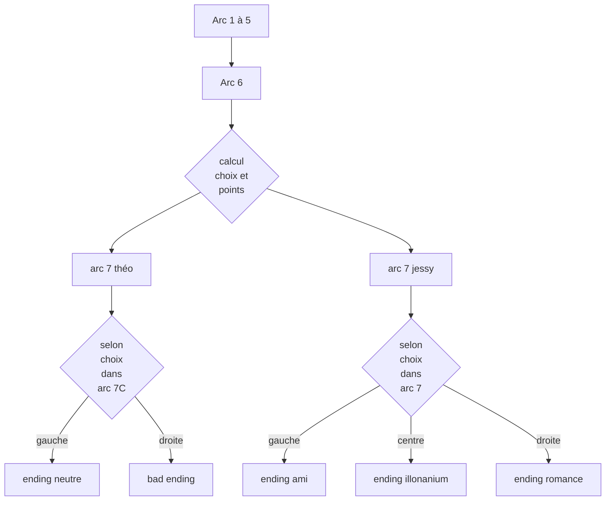

# Diagramme de flux - Arcs et Endings

## Structure

- **Arcs 1-5** → **Arc 6** : Progression linéaire
- **Calcul choix et points** : Point de décision basé sur les choix précédents
- **Arc 7** : Deux branches possibles
  - **Arc 7 théo** → 2 endings possibles
  - **Arc 7 jessy** → 3 endings possibles

## Endings

### Branche Théo
- Ending neutre
- Bad ending

### Branche Jessy
- Ending ami
- Ending illonanium
- Ending romance
